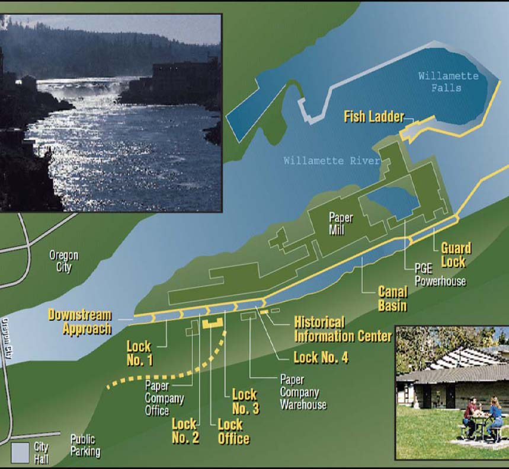

```{r setup, include=FALSE}
knitr::opts_chunk$set(echo = TRUE)

library(tidyverse)
library(here)
library(lubridate)
library(tsibble)
library(janitor)
library(feasts)
library(slider)
library(patchwork)
```

#### Willamette Falls adult fish passage 

Summary: This report will look at the adult fish passage recorded from January 2001 to December 2010 at the Willamette Falls fish ladder on the Willamette River (Oregon). This data was recorded by and accessible through the Columbia River DART project. Fish counting through Willamette Falls fishway was recorded using video cameras and time lapsed video recorders to record fish passage 24 hrs/day, 365 days/year.

Source: **Columbia River DART (Data Access in Real Time), 2010.** [Data Courtesy of U.S. Army Corps of Engineers, NWD and Chelan, Douglas, and Grant County PUDs, Yakima Klickitat Fisheries Project, Colville Tribes Fish & Wildlife (OBMEP), Oregon Department of Fish & Wildlife, Washington Department of Fish & Wildlife.](http://www.cbr.washington.edu/dart/query/adult_graph_text)


**Figure 1.** Map of Willamette Fish Ladder. 

```{r}


#basic info we should review from the metadata: http://www.cbr.washington.edu/dart/query/adult_proj_sum

#Willamette Falls: The Willamette Falls fish ladder was not operational on the following dates:

#11/29/2005-12/1/2005, 12/6/2005-12/8/2005, 12/13/2005-12/14/2005
#8/26/2008-9/21/2008
#8/23/2010-8/27/2010
#8/28/2020-10/5/2020: The Willamette Falls fishway was shut down for repairs from August 28 - October 5, 2020, which precluded passage above the falls. The extended fishway closure resulted in delayed migration and large numbers of fish holding below the falls. No pinniped activity was observed below the falls during this time period and no fish mortality events were reported suggesting the closure did not result in a significant loss in the fish population.

#Calculating the 10 year averages: The ten year averages are calculated by DART for each calendar day of data at each project. For the current year and any given project/month/day, the data is summed from the previous 10 years and divided by the number of non-null data points available during that 10 year span.


```


```{r}
#read in and wrangle the data

fish_main <- read_csv(here("data", "willamette_fish_passage.csv")) %>%
  replace(is.na(.), 0) %>%
  clean_names() %>% 
  select("date", "coho", "jack_coho", "steelhead") %>% 
  mutate(date = lubridate::mdy(date)) %>% 
  group_by(date, coho, jack_coho, steelhead) %>% 
  summarize(total_count = sum(coho, jack_coho, steelhead))


#time series dataframe 
fish_ts <- fish_main %>% 
  as_tsibble(key = NULL, index = date)
  

#time series df in pivot_longer format

fish_ts_longer <- fish_main %>% 
  as_tsibble(key = NULL, index = date) %>% 
  pivot_longer("coho":"steelhead",
               names_to = "species",
               values_to = "value") %>% 
  mutate(species = 
         ifelse(species == "coho", "Coho",
         ifelse(species == "jack_coho", "Jack Coho", 
         ifelse(species == "steelhead", "Steelhead", 
                "" )))) %>% 
  select(-total_count) %>% 
  rename(total_count = value)

#tab 3 data formatting

fish_longer <- fish_main %>% 
  pivot_longer("coho":"steelhead",
               names_to = "species",
               values_to = "value")

```

```{r, fig.show='hide'}
# we'll want to hide all these outputs.
#explore the data

#individually
ggplot(data = fish_ts, aes(x = date, y = coho)) +
  geom_line()

ggplot(data = fish_ts, aes(x = date, y = jack_coho)) +
  geom_line()

ggplot(data = fish_ts, aes(x = date, y = steelhead)) +
  geom_line()

#all three together
ggplot(data = fish_ts_longer, aes(x = date, y = total_count)) +
  geom_line(aes(color = species)) +
  facet_wrap(~species, scales = "free")

```

```{r, echo=FALSE, results='hide', fig.show='hide'}

#explore data by month and year using index_by() 

#by month
fish_month <- fish_ts_longer %>% 
  index_by(yr_mo = ~yearmonth(.)) %>% 
  group_by(yr_mo) %>% 
  summarize(month_mean_count = mean(total_count))

ggplot(data = fish_month, aes(x = yr_mo, y = month_mean_count)) +
  geom_line() +
  facet_wrap(~month(yr_mo, label = TRUE))

#by year
fish_year <- fish_ts_longer %>% 
  index_by(yearly = ~year(.)) %>% 
  summarize(yearly_mean_count = mean(total_count))

ggplot(data = fish_year, aes(x = yearly, y = yearly_mean_count)) +
  geom_col() +
  facet_wrap(~yearly)

```

## Tab 1 - Time Series (Hannah) {.tabset}
```{r, fig.cap="**Figure 2.** Time series of Coho, Jack Coho, and Steelhead counts on the Willamette fish ladder between 2001 and 2010."}
# explore data with initial graph
# ggplot(data = fish_ts_longer, aes(x=date, y=total_count)) +
#   geom_line() +
#   facet_wrap(~species)

# get species alone and use patchwork
# coho
coho_tab1 <- fish_ts_longer %>% 
  filter(species == "coho")

coho_graph <- ggplot(data=coho_tab1, aes(x=date, y=total_count)) +
  geom_line() +
  labs(title = "Coho", y="total count")

# jack_coho
jackcoho_tab1 <- fish_ts_longer %>% 
  filter(species == "jack_coho")

jackcoho_graph <- ggplot(data=jackcoho_tab1, aes(x=date, y=total_count)) +
  geom_line() +
  labs(title = "Jack Coho", y = "total count")

# steelhead
steelhead_tab1 <- fish_ts_longer %>% 
  filter(species == "steelhead")

steelhead_graph <- ggplot(data=steelhead_tab1, aes(x=date, y=total_count)) +
  geom_line() +
  labs(title = "Steelhead", y = "total count")

# patchwork

tab1_comb <- coho_graph / jackcoho_graph / steelhead_graph
tab1_comb
```

- Steelhead are by far the most abundant fish in the Willamette River, or they are just better at accessing the fish ladder. Steelhead have seasonality of when they pass through the fish ladder, but some years have larger counts than others.

- Both Coho and Jack Coho counts do not have the same seasonality that Steelhead have. Their counts are relatively low and there is a lack of an overall trend. It seems, though, that as more data gets collected, we may see some seasonality with their counts. 

## Tab 2 - Season Plots (Vanessa) {.tabset}
```{r, fig.cap="**Figure 3.** Season plots of Coho, Jack Coho, and Steelhead counts on the Willamette fish ladder between 2001 and 2010.", messages=FALSE, warning=FALSE}

#explore total counts with season plots

#fish_month %>% 
  #gg_season(y = month_mean_count)

#----------#

#explore counts per species with season plots

#fish_ts %>%
  #gg_season(y = total_count)

#----------#

# seasonal subseries plot

#fish_month %>% 
  #gg_subseries(month_mean_count)

#----------#

#final sesason plot

fish_ts_longer %>% 
  gg_season(y = total_count) +
  theme_minimal() +
  labs(x = "Date", y = "Total Count", 
       title = "Total Counts for Coho, Jack Coho, and Steelhead at Willamette Falls, Oregon",
       subtitle = "2001-2010")

```

### Season Plots

- Observed seasonal patterns can be seen across all three species. Coho and jack coho have similar seasonal passage of the falls, whereas steelhead have a longer, more sustained seasonal passage.

- Coho and jack coho have similar seasonal patterns with a serge occurring between late September and early October. Coho appear to have an increase in number of fish passing through in 2009 and 2010. Jack coho had a their highest count in 2008. 

- Steelhead trout pass through the falls over a much longer, sustained period between January through July. There is a slight rise in counts in May and June every year and then much less after July and August. In general, there are more steelhead passing through the falls each year than coho and jack coho. 

## Tab 3 - Annual Counts by Species (Tom) {.tabset}
```{r, messages=FALSE, warning=FALSE}
fish_annual <- fish_longer %>% 
  mutate(year = as.integer(year(date))) %>% 
  group_by(year, species) %>% 
  summarize(fish_yearly_total = sum(value))

fish_annual %>% 
  ggplot(aes(x = year, y = fish_yearly_total)) +
  geom_line(aes(color=species)) +
  labs(
    title = "Annual totals for fish passage by species (2000-2010)",
    x = "Year",
    y = "Count of fish passage"
  )

str(fish_annual$year)
```
**Figure 1:** The line graph above displays changes in fish passage by fish species between 2000 and 2010.

### Major Trends

- Steelhead observations appear to be most volatile over time with large spikes in passage over the first 5 years eventual stabilization from 2005 to 2009 followed by a large population spike.
- Jack coho's population remains relatively low and stable over time, seeing a small peak in population in 2008.
- Coho population has mild volatile over the first 8 years followed by a spike in population grow after 2008.